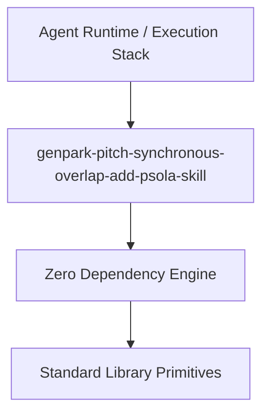

# genpark-pitch-synchronous-overlap-add-psola-skill

[](https://github.com/alphaparkinc/genpark-pitch-synchronous-overlap-add-psola-skill)
[](https://github.com/alphaparkinc/genpark-pitch-synchronous-overlap-add-psola-skill)
[](https://www.python.org/)

Time-domain Pitch-Synchronous Overlap-Add (TD-PSOLA) engine stretching or compressing speech timescales without altering pitch.



## Features
- **Strict 0 Pip Dependencies**: Built completely using the Python Standard Library.
- **Fast Execution & Verification**: Includes client wrapper, MCP server, and verified test suites.
- **Agentic AI Ready**: Exposes standard MCP tools for continuous LLM integration.

## Installation & Quickstart
```bash
git clone https://github.com/alphaparkinc/genpark-pitch-synchronous-overlap-add-psola-skill.git
cd genpark-pitch-synchronous-overlap-add-psola-skill
python example_usage.py
```
